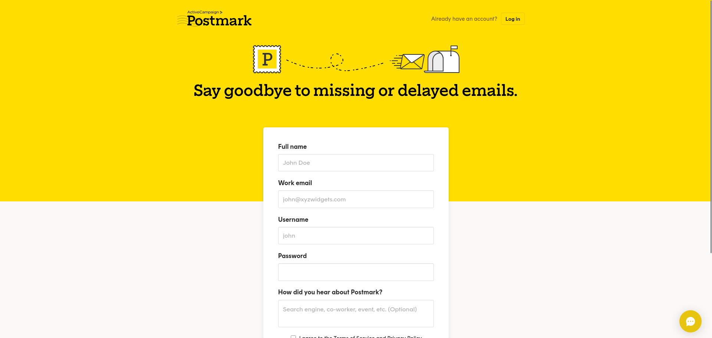

# EmailClient - 我们的的电子邮件传递组件

## 怎么发一封邮件

你究竟是如何发送电子邮件的?

它是如何工作的?

你必须了解一下 [SMTP](https://en.wikipedia.org/wiki/Simple_Mail_Transfer_Protocol)。

它自互联网早期就已存在——[第一个 RFC](https://tools.ietf.org/html/rfc821) 可以追溯到 1982 年。

SMTP 之于电子邮件的作用就如同 HTTP 之于网页：它是一个应用级协议，确保不同的电子邮件服务器和客户端实现能够相互理解并交换消息。

现在，让我们明确一点——我们不会构建自己的私人电子邮件服务器，这会耗费太长时间，

而且我们不会从中获益太多。我们将利用第三方服务。

如今的电子邮件递送服务需要什么？我们需要通过 SMTP 来与它们沟通吗?

不一定。

SMTP 是一种专用协议：除非你以前使用过电子邮件，否则你不太可能有直接使用它的经验。学习新的协议需要时间，而且过程中难免会犯错——这就是为什么大多数提供商会提供两个接口: SMTP 和 REST API。

如果您熟悉电子邮件协议，或者需要一些非常规的配置，那么
建议您使用 SMTP 接口。否则，大多数开发人员使用 REST API 会更快（也更可靠）地上手。

您可能已经猜到了，这也是我们的目标——我们将编写一个 REST 客户端。

### 选择一个电子邮件 API

市面上的电子邮件 API 提供商不胜枚举，你很可能知道一些主流提供商的名字——AWS SES、SendGrid、MailGun、Mailchimp 和 Postmark。

我正在寻找一个足够简单的 API（例如，发送一封电子邮件有多简单？）、一个流畅的入门流程和一个免费计划，无需输入信用卡信息即可测试服务。

就这样，我选择了 [Postmark](https://postmarkapp.com/)。

注: 译者认为使用 SaaS 平台来支持自己的服务不是最佳实践, 他自己会用自建的 SMTP 服务来发邮件, crates.io 上有很多 crate 可以帮助我们解决 SMTP 问题

要完成接下来的部分，您必须注册 `Postmark`, 并在登录其门户后，授权单个发件人电子邮件。



完成后，我们就可以继续了!

> 免责声明：Postmark 没有付费让我在这里推广他们的服务。

### 电子邮件客户端接口

开发一个新功能通常有两种方法: 一种是自下而上，从实现细节开始，慢慢地向上推进；另一种是自上而下，先设计接口，然后再（在一定程度上）确定实现的工作原理。

在这种情况下，我们将选择第二种方法。

我们希望我们的电子邮件客户端拥有什么样的接口?

我们希望有某种 `send_email` 方法。目前我们只需要一次发送一封电子邮件——当我们开始处理新闻通讯问题时，我们会处理批量发送电子邮件的复杂性。

`send_email` 应该接受哪些参数?

我们肯定需要收件人的电子邮件地址、邮件主题和邮件内容。我们会要求提供 HTML 和纯文本版本的电子邮件内容——有些邮件客户端无法渲染 HTML，有些用户也明确禁用了 HTML 邮件。为了安全起见，我们发送两个版本。

那么发件人的电子邮件地址呢?

我们假设客户端实例发送的所有邮件都来自同一个地址——
因此我们不需要将其作为 `send_email` 的参数，它会作为客户端本身构造函数的参数之一。

我们还希望 `send_email` 是一个异步函数，因为我们将执行 I/O 操作来与远程服务器通信。

将所有内容组合在一起，我们得到的内容大致如下:

```rs
//! src/email_client.rs
use crate::domain::SubscriberEmail;

pub struct EmailClient {
    sender: SubscriberEmail,
}

impl EmailClient {
    pub async fn send_email(
        &self,
        recipient: SubscriberEmail,
        subject: &str,
        html_content: &str,
        text_content: &str,
    ) -> Result<(), String> {
        todo!()
    }
}
```

```rs
//! src/lib.rs

// New entry!
pub mod email_client;
// [...]
```

还有一个未解决的问题——返回类型。我们草拟了一个 `Result<(), String>` 类，这相当于表达了“我稍后再考虑错误处理”的意思。

还有很多工作要做，但这只是一个开始——我们说过要从接口开始，而不是一次性搞定！

## 怎么使用 reqwest 写 REST 客户端

要与 REST API 通信，我们需要一个 HTTP 客户端。

Rust 生态系统中有一些不同的选择：同步 vs 异步、纯 Rust vs 绑定到底层原生库、与 tokio 或 async-std 绑定、固定 vs 高度可定制等等。

我们将选择 crates.io 上最受欢迎的选项：[reqwest](https://crates.io/crates/reqwest)。
关于 reqwest，您有什么想说的吗？

- 它已经过广泛的测试（下载量约 850 万次）
- 它提供了一个主要的异步接口，并可以通过阻止功能标志启用同步接口
- 它依赖于 tokio 作为其异步执行器，与我们已经在使用的 actix-web 兼容
- 如果您选择使用 rustls 来支持 TLS 实现（使用 rustls-tls 功能标志而不是 default-tls），它不依赖于任何系统库，因此具有极高的可移植性。

如果您仔细观察，就会发现我们已经在使用 reqwest！

它是我们在集成测试中用来向 API 发起请求的 HTTP 客户端。让我们将它从开发依赖项提升为运行时依赖项：

```toml
#! Cargo.toml
[dependencies]
# [...]
# We need the `json` feature flag to serialize/deserialize JSON paylaods
reqwest = { version = "0.12.23", default-features = false, features = ["json", "rustls-tls"] }

[dev-dependencies]
# Remove `reqwest`'s entry from this table
```

### reqwest::Client

使用 `reqwest` 时，主要处理的类型是 `reqwest::Client` - 它公开了我们向 REST API 执行请求所需的所有方法。

我们可以通过调用 `Client::new` 获取一个新的客户端实例，或者，如果需要调整默认配置，也可以使用 `Client::builder`。

我们暂时使用 `Client::new`。

让我们向 `EmailClient` 添加两个字段:

- `http_client`, 用于存储 `Client` 实例
- `base_url`, 用于存储我们将要发送请求的 API 的 URL

```rs
//! src/email_client.rs
use reqwest::Client;

use crate::domain::SubscriberEmail;

pub struct EmailClient {
    sender: SubscriberEmail,
    base_url: String,
    http_client: Client,
}

impl EmailClient {
    pub fn new(base_url: String, sender: SubscriberEmail) -> Self {
        Self {
            http_client: Client::new(),
            base_url,
            sender,
        }
    }

    // [...]
}
```

### 连接池

在对远程服务器上托管的 API 执行 HTTP 请求之前，我们需要建立连接。

事实证明，连接是一项相当昂贵的操作，如果使用 HTTPS 连接则更是如此：每次需要发起请求时都创建一个全新的连接会影响应用程序的性能，并可能导致所谓的“负载下套接字耗尽”问题。

为了缓解这个问题，大多数 HTTP 客户端都提供了连接池：在对远程服务器的第一个请求完成后，它们会保持连接打开（一段时间），并在我们需要向同一服务器发起另一个请求时重新使用它，从而避免了重新建立连接。

reqwest 也不例外——每次创建 `Client` 实例时，reqwest 都会在底层初始化一个连接池。

为了利用这个连接池，我们需要在多个请求中重用同一个 `Client`。

还需要指出的是, `Client::clone` 不会创建新的连接池——我们只是克隆一个指向底层连接池的指针。

### 怎么在 actix-web 中复用相同的 reqwest::Client

为了在 actix-web 中的多个请求中重复使用同一个 HTTP 客户端，我们需要在应用上下文中存储它的副本。 ——这样我们就可以使用提取器（例如 `actix_web::web::Data`）在请求处理程序中检索对客户端的引用。

如何实现呢？让我们看一下构建 HttpServer 的代码:

```rs
//! src/startup.rs
// [...]
pub fn run(
    listener: TcpListener,
    db_pool: PgPool,
) -> Result<Server, std::io::Error> {
    let db_pool = web::Data::new(db_pool);

    let server = HttpServer::new(move || {
        App::new()
            // Middlewares are added using the `wrap` method on `App`
            .wrap(TracingLogger::default())
            .route("/health_check", web::get().to(health_check))
            .route("/subscriptions", web::post().to(subscribe))
            .app_data(db_pool.clone())
    })
    .listen(listener)?
    .run();

    Ok(server)
}
```

我们有两个选择:

- 为 `EmailClient` 派生 `Clone` trait，构建一次它的实例，然后在每次需要构建应用时将一个克隆传递给 app_data:

```rs
//! src/email_client.rs
#[derive(Debug)]
pub struct EmailClient {
    sender: SubscriberEmail,
    base_url: String,
    http_client: Client,
}

// [...]
```

```rs
//! src/startup.rs
use crate::email_client::EmailClient;
// [...]

pub fn run(
    listener: TcpListener,
    db_pool: PgPool,
    email_client: EmailClient,
) -> Result<Server, std::io::Error> {
    let db_pool = web::Data::new(db_pool);

    let server = HttpServer::new(move || {
        App::new()
            // Middlewares are added using the `wrap` method on `App`
            .wrap(TracingLogger::default())
            .route("/health_check", web::get().to(health_check))
            .route("/subscriptions", web::post().to(subscribe))
            .app_data(db_pool.clone())
            .app_data(email_client.clone())
    })
    .listen(listener)?
    .run();

    Ok(server)
}
```

- 将 `EmailClient` 包装在 `actix_web::web::Data` (一个 `Arc` 指针) 中, 并在每次需要构建应用程序时将指针传递给 app_data——就像我们在 PgPool 中所做的那样:

```rs
//! src/startup.rs
use crate::email_client::EmailClient;


pub fn run(
    listener: TcpListener,
    db_pool: PgPool,
    email_client: EmailClient,
) -> Result<Server, std::io::Error> {
    let db_pool = web::Data::new(db_pool);
    let email_client = web::Data::new(email_client);

    let server = HttpServer::new(move || {
        App::new()
            // Middlewares are added using the `wrap` method on `App`
            .wrap(TracingLogger::default())
            .route("/health_check", web::get().to(health_check))
            .route("/subscriptions", web::post().to(subscribe))
            .app_data(db_pool.clone())
            .app_data(email_client.clone())
    })
    .listen(listener)?
    .run();

    Ok(server)
}
```

哪种方法最好?

如果 EmailClient 只是 Client 实例的包装器，那么第一种方案会更可取——我们避免使用 Arc 两次包装连接池。

但事实并非如此: `EmailClient` 附加了两个数据字段 (`base_url` 和 `sender`)。

第一种实现会在每次创建 App 实例时分配新的内存来保存这些数据的副本，而第二种实现则会在所有 App 实例之间共享这些数据。

这就是我们使用第二种策略的原因。

但请注意: 我们为每个线程创建一个 App 实例——从全局来看，字符串分配 (或指针克隆) 的成本可以忽略不计。

我们在这里将这个决策过程作为一个练习，以了解其中的利弊——将来您可能需要做出类似的决策，届时两种方案的成本可能会有显著差异。

### 配置我们的 EmailClient

如果你运行 `cargo check` 你将会得到如下错误

```plaintext
error[E0061]: this function takes 3 arguments but 2 arguments were supplied
  --> src/main.rs:24:5
   |
24 |     run(listener, connection_pool)?.await
   |     ^^^--------------------------- argument #3 of type `EmailClient` is mis
sing
   |
```

让我们修复它!

`main` 函数现在有什么?

```rs
//! src/main.rs
// [...]

#[tokio::main]
async fn main() -> std::io::Result<()> {
    // [...]

    let configuration = get_configuration().expect("Failed to read config");
    let connection_pool = PgPoolOptions::new()
        .acquire_timeout(std::time::Duration::from_secs(2))
        .connect_lazy_with(configuration.database.with_db());

    let address = format!(
        "{}:{}",
        configuration.application.host, configuration.application.port
    );
    let listener = TcpListener::bind(address)?;

    run(listener, connection_pool)?.await
}
```

我们正在使用通过 `get_configuration` 获取的配置中指定的值来构建应用程序的依赖项。

要构建 `EmailClient` 实例，我们需要获取要向其发送请求的 API 的基本 URL 以及发件人的电子邮件地址 - 让我们将它们添加到 `Settings` 结构体中:

```rs
//! src/configuration.rs
// [...]

use crate::domain::SubscriberEmail;

#[derive(serde::Deserialize)]
pub struct Settings {
    pub database: DatabaseSettings,
    pub application: ApplicationSettings,
    pub email_client: EmailClientSettings,
}

#[derive(serde::Deserialize)]
pub struct EmailClientSettings {
    pub base_url: String,
    pub sender_email: String,
}

impl EmailClientSettings {
    pub fn sender(&self) -> Result<SubscriberEmail, String> {
        SubscriberEmail::parse(self.sender_email.clone())
    }
}
```

然后我们需要在配置文件中为它们设置值:

```yaml
#! configuration/base.yaml
application:
  # [...]

database:
  # [...]

email_client:
  base_url: "localhost"
  sender_email: "test@gmail.com"
```

```yaml
#! configuration/production.yaml
application:
  host: 0.0.0.0
database:
  require_ssl: true

email_client:
  # Value retrieved from Postmark's API documentation
  base_url: "https://api.postmarkapp.com"
  sender_email: "something@gmail.com"
```

我们现在可以在 `main` 中构建一个 `EmailClient` 实例并将其传递给 `run` 函数:

```rs
//! src/main.rs
// [...]
use zero2prod::email_client::EmailClient;

#[tokio::main]
async fn main() -> std::io::Result<()> {
    let subscriber = get_subscriber("zero2prod", "info", std::io::stdout);
    init_subscriber(subscriber);

    let configuration = get_configuration().expect("Failed to read config");
    let connection_pool = PgPoolOptions::new()
        .acquire_timeout(std::time::Duration::from_secs(2))
        .connect_lazy_with(configuration.database.with_db());

    // Build an `EmailClient` using `configuration`
    let sender_email = configuration.email_client.sender()
        .expect("Invalid sender email address");
    let email_client = EmailClient::new(
        configuration.email_client.base_url,
        sender_email,
    );

    let address = format!(
        "{}:{}",
        configuration.application.host, configuration.application.port
    );
    let listener = TcpListener::bind(address)?;

    run(listener, connection_pool, email_client)?.await
}
```

`cargo check` 现在应该可以通过了，尽管有一些关于未使用变量的警告——我们很快就会处理它们。
我们的测试怎么样?

`cargo check --all-targets` 返回的错误与我们之前使用 `cargo check` 时看到的类似:

```plaintext
error[E0061]: this function takes 3 arguments but 2 arguments were supplied
  --> tests/health_check.rs:48:18
   |
48 | ...rver = zero2prod::run(listener, connection_pool.clone()).expect("Fail...
   |           ^^^^^^^^^^^^^^----------------------------------- argument #3 of 
type `EmailClient` is missing
   |
```

你说得对——这是代码重复的症状。我们会重构集成测试的初始化逻辑，但目前还不行。

让我们快速打个补丁，让它能编译通过:

```rs
//! tests/health_check.rs
// [...]
use zero2prod::email_client::EmailClient;

async fn spawn_app() -> TestApp {
    // [...]

    // Build a new email client
    let sender_email = configuration.email_client.sender()
        .expect("Invalid sender email address.");
    let email_client = EmailClient::new(
        configuration.email_client.base_url,
        sender_email
    );

    let server = zero2prod::run(listener, connection_pool.clone(), email_client)
        .expect("Failed to bind address");
    let _ = tokio::spawn(server);

    TestApp {
        address,
        db_pool: connection_pool,
    }
}
```

`cargo test` 现在应该可以通过了

## 怎么测试一个 REST 客户端

我们已经完成了大部分设置步骤：我们绘制了 EmailClient 的接口，并使用新的配置类型 EmailClientSettings 将其与应用程序连接起来。

为了坚持我们的测试驱动开发方法，现在是时候编写测试了!

我们可以从集成测试开始: 修改 POST /订阅的测试，以确保端点符合我们的新要求。

不过，要让它们通过测试需要很长时间：除了发送电子邮件之外，我们还需要添加逻辑来生成并存储唯一的令牌。
让我们从小处着手：我们将单独测试 EmailClient 组件。

这将增强我们对它在作为一个单元进行测试时是否符合预期的信心，从而减少将其集成到更大的确认电子邮件流程中可能遇到的问题。

这也让我们有机会看看最终的界面是否符合人体工程学且易于测试。

我们实际上应该测试什么?

`EmailClient::send_email` 的主要目的是执行 HTTP 调用：: 我们如何知道
它是否发生了？我们如何检查正文和标头是否按预期填充?

我们需要拦截该 HTTP 请求——是时候启动一个模拟服务器了!

## 使用 wiremock 进行 HTTP 模拟

让我们在 `src/email_client.rs` 的底部添加一个新的测试模块，其中包含一个新测试的框架:

```rs
//! src/email_client.rs
// [...]

#[cfg(test)]
mod tests {
    #[tokio::test]
    async fn send_email_fires_a_request_to_base_url() {
        todo!()
    }
}
```

这不会立即编译 - 我们需要在 Cargo.toml 中向 tokio 添加两个 feature flags:

```toml
[dev-dependencies]
# [...]
tokio = { version = "1", features = ["rt", "macros"] }
```

我们对 `Postmark` 的了解还不够，无法断言我们应该在传出的 `HTTP` 请求中看到什么。

不过，正如测试名称所示，可以合理地预期会向服务器发送一个请求，地址是 `EmailClient::base_url`!

让我们将 `wiremock` 添加到我们的开发依赖项中:

```shell
cargo add wiremock --dev
```

使用 `wiremock`, 我们可以将 `send_email_fires_a_request_to_base_url` 写成如下形式:

```rs
//! src/email_client.rs
// [...]

#[cfg(test)]
mod tests {
    use fake::{faker::{internet::en::SafeEmail, lorem::en::Sentence}, Fake};
    use wiremock::{matchers::any, Mock, MockServer, ResponseTemplate};

    use crate::{domain::SubscriberEmail, email_client::EmailClient};

    #[tokio::test]
    async fn send_email_fires_a_request_to_base_url() {
        // Arrange
        let mock_server = MockServer::start().await;
        let sender = SubscriberEmail::parse(SafeEmail().fake()).unwrap();
        let email_client = EmailClient::new(mock_server.uri(), sender);

        Mock::given(any())
            .respond_with(ResponseTemplate::new(200))
            .expect(1)
            .mount(&mock_server)
            .await;

        let subscriber_email = SubscriberEmail::parse(SafeEmail().fake()).unwrap();

        let subject: String = Sentence(1..2).fake();
        let content: String = Sentence(1..10).fake();

        // Act
        let _ = email_client
            .send_email(subscriber_email, &subject, &content, &content)
            .await;

        // Assert
    }
}
```

让我们一步一步分析一下正在发生的事情。

```rs
let mock_server = MockServer::start().await;
```

### wiremock::MockServer

TODO: WIP
