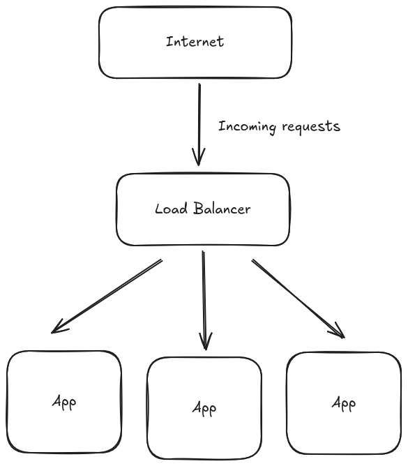
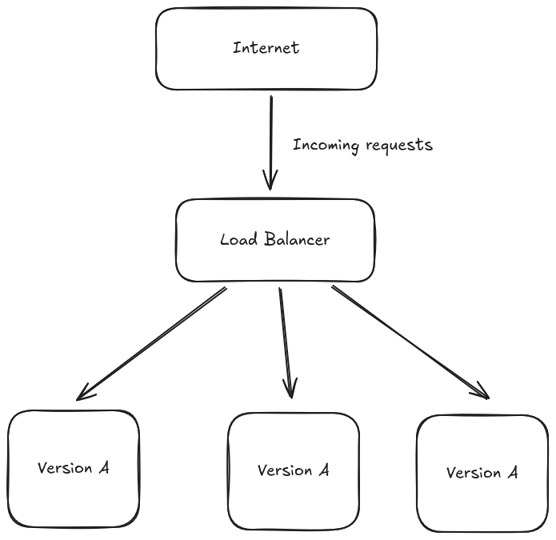
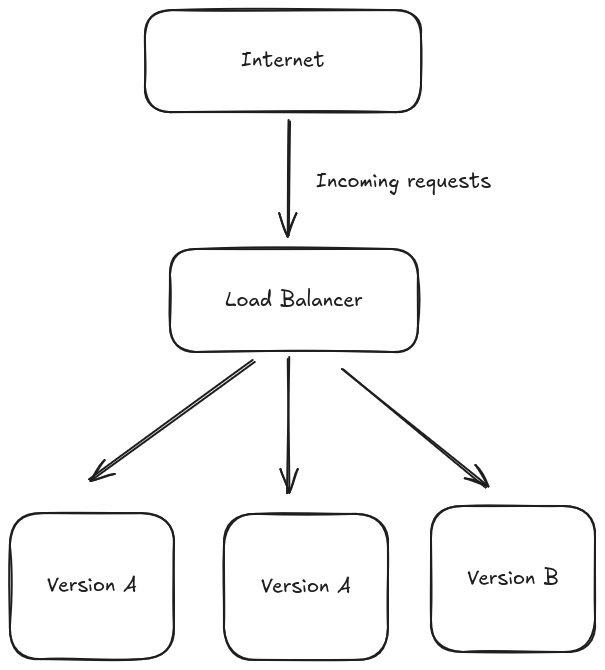

# 零停机部署

## 可靠性

在第五章中，我们将应用程序部署到了一家公有云提供商。

它已经上线：我们目前还不会发送新闻简报，但用户可以在我们解决这个问题的同时订阅。

一旦应用程序开始服务于生产流量，我们就需要确保它的可靠性。

“可靠性”在不同的语境下有不同的含义。例如，如果您销售的是数据存储解决方案，它就不应该丢失（或损坏！）客户的数据。

在商业环境中，应用程序的可靠性定义通常会被编码在服务水平协议 (SLA) 中。

SLA 是一项合同义务：您保证一定的可靠性，并承诺在服务未能达到预期时向客户进行补偿（通常以折扣或积分的形式）。

例如，如果您销售的是 API 访问权限，通常会包含一些与可用性相关的内容，例如API 应该能够成功响应至少 99.99% 的格式正确的传入请求，这通常被称为“四个九的可用性”。

换句话说（假设传入请求随时间均匀分布），您一年内最多只能承受 52 分钟的停机时间。实现四个九的可用性非常困难。
构建高可用性解决方案没有灵丹妙药：它需要从应用层一直到基础设施层的努力。

但有一点是肯定的：如果您想要运营高可用性服务，您应该掌握
零停机部署——用户应该能够在新版本应用程序部署到生产环境之前、期间和之后使用该服务。

如果您正在实施持续部署，这一点就更为重要: 您不能每天发布多次，因为每次发布都会触发一次小规模的中断。

## 部署策略

### 简单部署

在深入探讨零停机部署之前，我们先来看看“简单”的方法。
我们服务的 A 版本正在生产环境中运行，现在我们想要推出 B 版本:

- 我们关闭集群中所有 A 版本的实例
- 我们启动运行 B 版本的应用程序的新实例
- 我们开始使用 B 版本处理流量

集群中没有应用程序可以处理用户流量，这种情况持续一段时间——我们正经历停机!

为了做得更好，我们需要仔细研究我们的基础设施是如何设置的。

### Load Balancers

我们的应用程序在**负载均衡器**后运行多个副本。

每个应用程序副本都作为后端注册到负载均衡器。

每当有人向我们的 API 发送请求时，都会访问我们的负载均衡器，然后负载均衡器负责选择一个可用的**后端**来处理传入的请求。

负载均衡器通常支持**动态**添加（和删除）后端。

这实现了一些有趣的模式。

#### 水平扩展

当流量激增时，我们可以通过启动更多应用程序副本（即水平扩展）来增加容量。

这有助于分散负载，直到单个实例的预期工作量变得可控。

我们将在本书后面讨论指标和自动扩展时再次讨论这个主题。

#### 可用性检测

我们可以让负载均衡器密切关注已注册后端的健康状况。

简单来说，健康检查可以分为:

- 被动 - 负载均衡器查看每个后端的状态码/延迟分布，以确定它们是否健康
- 主动 - 负载均衡器配置为按计划向每个后端发送健康检查请求。如果后端在足够长的时间内未能返回成功状态码，则会被标记为不健康并被移除

这是在云原生环境中实现自我修复的关键功能: 平台可以检测应用程序是否运行异常，并自动将其从可用后端列表中移除，以减轻或消除对用户的影响。

#### 滚动更新部署

我们可以利用负载均衡器来执行零停机部署。

我们首先启动应用程序 B 版本的一个副本。

当应用程序准备好处理流量时（例如，一些健康检查请求已成功），我们将其注册为负载均衡器的后端。

我们现在有四个应用程序副本：3 个运行版本 `A`，1 个运行版本 `B`。这四个副本都在提供实时流量。

如果一切正常，我们会关闭其中一个运行版本 `A` 的副本。

我们遵循相同的流程替换所有运行版本 A 的副本，直到所有注册的后端都运行版本 B。

这种部署策略称为滚动更新：我们同时运行应用程序的新旧版本，并同时使用它们来处理实时流量。

在整个过程中，我们始终拥有三个或更多健康的后端：用户应该不会遇到任何服务降级（假设版本 B 没有错误）。

### Digital Ocean App Platform

我们的应用程序运行在 Digital Ocean 应用平台上。
他们的文档宣称提供开箱即用的零停机部署，但却没有提供实现细节。

一些实验证实，他们确实依赖于滚动更新部署策略。

滚动更新并非实现零停机部署的唯一策略——[蓝绿部署](https://martinfowler.com/bliki/BlueGreenDeployment.html)和[金丝雀部署](https://martinfowler.com/bliki/CanaryRelease.html)也是基于相同底层原则的流行变体。

请根据您的平台提供的功能和需求，为您的应用程序选择最合适的解决方案。

译者注: 另外一个可能的方案是 Kubernetes.
